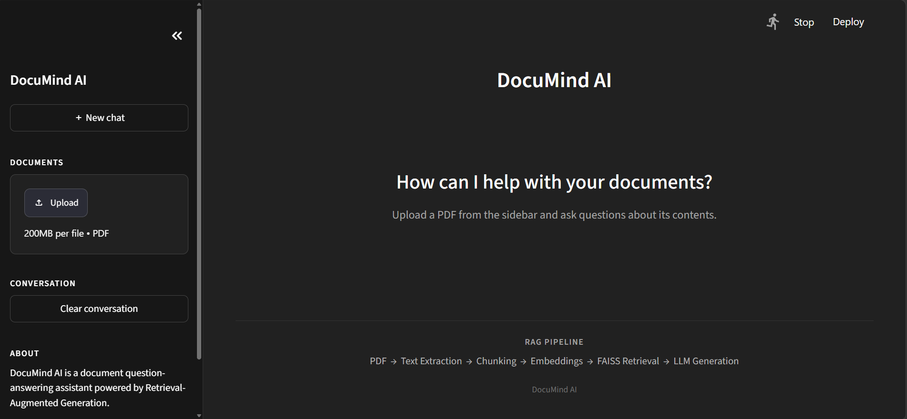

### DocuMind AI
RAG-Based Intelligent Document Question Answering System

[Live Demo](https://documind-ai-6tqwd3rg6rnsendelwpwfj.streamlit.app) | [📂 GitHub Repository](https://github.com/thesrisaga/documind-ai)

DocuMind AI is an intelligent document question-answering system built using Retrieval-Augmented Generation (RAG).

The system allows users to upload PDF documents and ask natural-language questions about their contents. Instead of sending the entire document directly to an LLM, DocuMind AI retrieves the most relevant passages using semantic search and provides them as context to the language model.
This helps produce answers that are grounded in the uploaded document and provides source page references for transparency.

## Project Overview

DocuMind AI follows a complete Retrieval-Augmented Generation pipeline:
PDF → Text Extraction → Chunking → Embeddings → FAISS Retrieval → LLM Generation → Grounded Answer
The system combines document processing, semantic search, vector retrieval, and large language models into a single application.
## Key Features
- PDF document upload
- Automatic text extraction from PDF files
- Overlapping text chunking
- Semantic text embeddings
- FAISS vector similarity search
- Retrieval-Augmented Generation
- Groq LLM integration
- Context-grounded answers
- Source page references
- Multi-turn document conversation
- Retrieval evaluation
- Answer grounding evaluation
- Streamlit-based interface

## System Architecture
 
                    ┌─────────────────┐
                    │   PDF Document  │
                    └────────┬────────┘
                             │
                             ▼
                    ┌─────────────────┐
                    │ Text Extraction │
                    │    PyMuPDF      │
                    └────────┬────────┘
                             │
                             ▼
                    ┌─────────────────┐
                    │    Chunking     │
                    │  800 characters │
                    │  150 overlap    │
                    └────────┬────────┘
                             │
                             ▼
                    ┌─────────────────┐
                    │   Embeddings    │
                    │ all-MiniLM-L6-v2│
                    └────────┬────────┘
                             │
                             ▼
                    ┌─────────────────┐
                    │  FAISS Vector   │
                    │      Store      │
                    └────────┬────────┘
                             │
                       User Question
                             │
                             ▼
                    ┌─────────────────┐
                    │    Retriever    │
                    │   Top-K Chunks  │
                    └────────┬────────┘
                             │
                             ▼
                    ┌─────────────────┐
                    │    Groq LLM     │
                    │ Answer Generation│
                    └────────┬────────┘
                             │
                             ▼
                    ┌─────────────────┐
                    │ Grounded Answer │
                    │ + Source Pages  │
                    └─────────────────┘


## Project Structure


```text
documind-ai/
│
├── app/
│   └── streamlit_app.py
│
├── src/
│   ├── ingestion/
│   │   ├── __init__.py
│   │   └── pdf_loader.py
│   │
│   ├── preprocessing/
│   │   ├── __init__.py
│   │   └── chunker.py
│   │
│   ├── embeddings/
│   │   ├── __init__.py
│   │   └── embedding_model.py
│   │
│   ├── retrieval/
│   │   ├── __init__.py
│   │   ├── vector_store.py
│   │   └── retriever.py
│   │
│   └── generation/
│       ├── __init__.py
│       └── llm.py
│
├── tests/
│   ├── __init__.py
│   ├── test_pdf.py
│   ├── test_chunker.py
│   ├── test_embeddings.py
│   ├── test_vector_store.py
│   ├── test_retriever.py
│   ├── test_rag.py
│   ├── test_evaluation.py
│   └── test_answer_evaluation.py
│
├── screenshots/
│   └── documind-home.png
│
├── .gitignore
├── LICENSE
├── README.md
└── requirements.txt
 ```
## Main Components

- PDF Ingestion — Extracts text and page information from PDF documents.
- Chunking — Splits documents into overlapping text segments.
- Embeddings — Converts text chunks into numerical vector representations.
- FAISS Retrieval — Finds the most relevant document chunks for a user query.
- LLM Generation — Generates answers using retrieved document context.
- Source Attribution — Displays the document pages used to generate an answer.
- Evaluation — Tests retrieval quality and answer grounding.
- Streamlit UI — Provides an interactive interface for uploading documents and asking questions.

## Technologies Used

- Python
- Streamlit
- PyMuPDF
- Sentence Transformers
- FAISS
- NumPy
- Groq API
- Large Language Models
- Git & GitHub

## Installation

git clone https://github.com/thesrisaga/documind-ai.git
cd documind-ai
pip install -r requirements.txt

## Environment Configuration

Set your Groq API key as an environment variable:
$env:GROQ_API_KEY="YOUR_API_KEY"
Do not commit API keys or other secrets to GitHub.

## Running the Application

streamlit run app/streamlit_app.py
Upload a PDF document, enter a question, and DocuMind AI will retrieve relevant document passages and generate a grounded answer.

## Evaluation

The project includes tests for:
- PDF text extraction
- Text chunking
- Embedding generation
- FAISS vector retrieval
- Retriever functionality
- End-to-end RAG generation
- Retrieval evaluation
- Answer grounding evaluation

## Application Preview



## Demo / Usage

1. Launch the Streamlit application.
2. Upload one or more PDF documents.
3. Wait for the documents to be processed and indexed.
4. Enter a natural-language question about the uploaded documents.
5. DocuMind AI retrieves the most relevant document passages.
6. The retrieved context is passed to the LLM for answer generation.
7. The application displays the grounded answer along with the source pages.

### Example

**Question:**

> What factors influence successful stem cell differentiation?

**Result:**

DocuMind AI retrieves relevant passages from the research paper and generates an answer based only on the retrieved document context.

The application also displays the source pages used to generate the answer.

### Out-of-Document Questions

DocuMind AI is designed to avoid unsupported answers.

If a question cannot be answered using the uploaded documents, the system responds:

> I could not find sufficient information in the provided documents.

This helps reduce hallucinations and keeps generated answers grounded in the available document evidence.
 
## Future Improvements

- Conversation history
- Improved source citation
- RAG evaluation metrics
- Retrieval quality optimization
- Document comparison
- Improved UI/UX
- Cloud deployment

License
This project is licensed under the MIT License.
